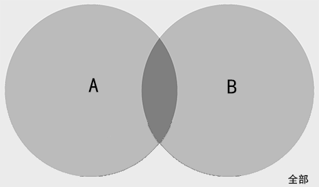
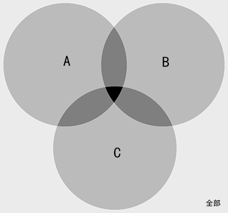

<link rel="stylesheet" href="https://zhmhbest.gitee.io/hellomathematics/style/index.css">

# [数量关系](./index.html)

[TOC]

## 数的性质

### 奇偶

- 加减
  - 奇和为偶：`奇 + 奇 = 偶`
  - 奇偶和奇：`奇 + 偶 = 奇`、`偶 + 奇 = 奇`
  - 和差同性：`M + N`与`M - N`的奇偶同性
  - 同和为偶：`X + X = 偶`
- 相乘
  - 有偶为偶：`奇 × 奇 × ... × 偶 = 偶`
  - 全奇为奇：`奇 × 奇 × ... × 奇 = 奇`

**例**：77个蛋糕，大盒能装15个，小盒能装8个，要求恰好装满，问需要几个盒子。

$77 = 15x + 8y$，因为$77$为奇数、$8y$为偶数，所以$15x$一定为奇数，即$x$一定为奇数。$x$在$1,3,5$中尝试，得$x=3$，$y=4$，$x+y=7$。

### 整除

若$a$能被$b$整除，则$a ~mod~ b = 0$。

| 数字 | 方法                                                         | 例子                                                         |
| ---: | :----------------------------------------------------------- | :----------------------------------------------------------- |
|    2 | **个位**是否能被2整除                                        | 122、254                                                     |
|    5 | **个位**是否能被5整除                                        | 255、395                                                     |
|    4 | **末2位**是否能被4整除                                       | 812、724、636                                                |
|   25 | **末2位**是否能被25整除                                      | 725、825                                                     |
|    3 | **各位数字和**能否被3整除                                    | 156（`1+5+6=9`）                                             |
|    9 | **各位数字和**能否被9整除                                    | 675（`6+7+5=18`）                                            |
|    7 | 个位2倍与剩下数之差能被7整除或 末3位与剩下数之差能被7整除 | 392（`4-39=-35`） 8442（`442-8=434`、`8-43=35`）          |
|   11 | `奇数位和-偶数位和`能被11整除或 末3位与剩下数之差能被11整除 | 9658（`658-9=649`、`6+9-4=11`） 15235（`235-15=220`、`2+0-2=0`） |
|   13 | 末3位与剩下数之差能被13整除                                  | 1274（`274-1=273=260+13`）                                   |

**补充性质**：

- 整除传递：$\{a ~mod~ b = 0 ~\&\&~ b ~mod~ c = 0\} ~⇒~ \{a ~mod~ c = 0\}$
- 同子和差：$\{a ~mod~ c = 0 ~\&\&~ b ~mod~ c = 0\} ~⇒~ \{(a+b) ~mod~ c = 0 ~\&\&~ (a-b) ~mod~ c = 0\}$
- 倍父同效：$\{a ~mod~ c = 0 ~\&\&~ n∈N\} ~⇒~ \{na ~mod~ c = 0\}$
- 同堂互质：$\{a ~mod~ b = 0 ~\&\&~ a ~mod~ c = 0 ~\&\&~ a,b互质\} ~⇒~ \{a ~mod~ bc = 0\}$

### 同余

若$\{a ~mod~ c = b ~mod~ c\}$，则称$a$、$b$对于$c$同余。

- 设$a=xc+v$、$b=yc+w$
  - $(a+b)~mod~c = (v+w)~mod~c$
  - $(a-b)~mod~c = (v-w)~mod~c$
  - $(a \cdot b)~mod~c = (v \cdot w)~mod~c$

**例1**：求$2011×2012$的余数

$2011×2012~mod~6 = (2011~mod~6)×(2012~mod~6) = (1×2)~mod~6 = 2$

**例2**：一个整数除$x,y,z$的余数都为$r$，求这个整数。

余同加余：`(x, y, z)的最小公倍数 + r`

**例3**：一个整数除$x,y,z$的余数分别为$(r-x),(r-y),(r-z)$，求这个整数。

和同加和：`(x, y, z)的最小公倍数 + r`

**例4**：一个整数除$x,y,z$的余数分别为$(x-r),(y-r),(z-r)$，求这个整数。

差同加差：`(x, y, z)的最小公倍数 + r`

### 求最大公因数

**互质**：若$a$、$b$的最大公因数为$1$，则称$a$、$b$互质。

**求解方法**：质因数分解。

### 求最小公倍数

**求解方法**：先求最大公因数、再将两边剩余因数相乘、最后乘以最大公因数。

**例1**：求`24`与`36`的最小公倍数

- `24 = 2 × 12`、`36 = 3 × 12`则`2 × 3 × 12 = 72`

**例2**：已知$
    \begin{cases}
        60 = x_1 + x_2 + y_1 + y_2 + z
    \\  4(x_2+y_2) = (x_1+y_1)
    \\  (y_1+y_2) = 7(x_1+x_2)
    \end{cases}
$，问$z=?$（变量全为整数）

$A.12 ~~ B.15 ~~ C.20 ~~ D.25$

$
    \begin{cases}
        (x_2 + y_2) = \dfrac{60 - z}{5}
    \\  (x_1 + x_2) = \dfrac{60 - z}{8}
    \end{cases}
$

即$(60-z)$为$5$和$8$的最小公倍数，即为$40$，故$z=20$

### 和差倍比

- **和倍关系**：已知$s=(a+b)$、$p=\dfrac{a}{b}$，则$b=\dfrac{s}{p+1}$
- **和差关系**：已知$s=(a+b)$、$d=(a-b)$，则$a=\dfrac{s+d}{2}$

**例1**：三人生肖相同，年龄和为72，则年龄最小的人今年不可能为：

$A.6 ~~ B.8 ~~ C.12 ~~ D.16$

设最小的人年龄为$x$，其它两人分别为$(x+a)$、$(x+b)$，则有

$72 = x + (x+a) + (x+b)$，即$(a+b) = 72 - 3x$

三人生肖相同，故$(a+b)$一定为$12$的整数倍

故$3x$也一定为$12$的整数倍，即$x$为4的整数倍

综上答案为$A$

## 数列规律

>①前两项与后一项（可能有间隔）的关系（$a_{i+1} = a_{i} ~?~ a_{i-1}$）
>②位置信息代入什么公式（线性$+i,×i$、指数$+i^n,×i^n$）
>③数本身是否已经包含位置信息（$a_i = i × ~?~$）

### 做差法

**例**：`1, 2, 4, 7, 11, ( ), ( )`。

- 作差：`1, 2, 3, 4, (5), (6)`
- 结果：`1, 2, 4, 7, 11, (16), (22)`

### 做商法

**例**：`3, 6, 18, 72, 360, ( )`。

- 做商：`2, 3, 4, 5, (6)`
- 结果：`3, 6, 18, 72, 360, (2160)`

### 乘积法

**例**：`1, 2, 3, 8, 27, 220, ( )`。

- 作积：`1×2+1=3, 2×3+2=8, 3×8+3=27, 8×27+4=220, 27×220+5=(5945)`

### 求和法

**例**：`1, 2, 3, 5, 8, 13, 21, ( )`。

- 作和：`1+2=3, 2+3=5, 5+8=13, 8+13=21, 13+21=(34)`

### 指数法

>$i^2: {0,1,4,9,16,25,\cdots}$
>$i^2-i: {0,0,2,6,12,20,\cdots}$
>$i^3: {0,1,8,27,64,125,\cdots}$
>$i^3-i: {0,0,6,24,60,120,\cdots}$

**例**：`0, 0, 6, 24, 60, 120, ()`。

- 指数：`0**3-0=0, 1**3-1=0, 2**3-2=6, 3**3-3=24, 4**3-4=60, 5**3-5=120, 6**3-6=(210)`

### 分解法

**例**：`3, 8, 15, 24, ( )`。

- 分解：`1×2+1=3, 2×3+2=8, 3×4+3=15, 4×5+4=24, 5×6+5=(35)`

## 年龄问题

**解题思路**：某时间段年龄$x$、$y$，关系为$f(x,y)$，$n$年后关系$g(x+n,y+n)$，则有

$
    \begin{cases}
        f(x,y)
    \\  g(x+n,y+n)
    \end{cases}
$

**例**：$3$年前A是B的年龄的$17$倍，$3$年后，A是B的年龄的$5$倍，问B现在多少岁。

设3年前A、B年龄分别为$x$、$y$，则有：

$
    \begin{cases}
        x = y × 17
    \\  (x+6) = (y+6) × 5
    \end{cases}
$

解得$x=34$、$y=2$

## 行程问题

### 火车问题

**火车过桥**：`速度 × 时间 = 车长 + 桥长`

**火车相遇**：`相遇时间 × (甲车速 + 乙车速) = 甲车长 + 乙车长 + 甲乙距离`

**火车追及**：`追及时间 × (甲车速 - 乙车速) = 甲车长 + 乙车长 + 甲乙距离`

**例**：一列火车长150米，速度19m/s。全车通过长800米的大桥，需要多少时间

$t = \dfrac{150 + 800}{19} = 50s$

### 流水问题

**解题思路**：`(船速 + 水速) × 顺行时间 = (船速 - 水速) × 逆行时间`

**例**：甲船从A地航行到下游需要$6$小时，由B地航行到A地需要$12$小时，乙船在静水中的速度是甲船的$3$倍，问乙从B航行到A需要多长时间。

设两地距离为$L$，水速为$s$，甲船速度为$v$，则有：

$
    \begin{cases}
        L = (v+s)6 = (v-s)12 ~⇒~ v=3s,L=24s
    \\  \dfrac{L}{3v-s} = \dfrac{24s}{9s-s} = 3
    \end{cases}
$

### 相遇问题

**相向相遇**：`两地距离 = 相遇耗时 × (甲速度 + 乙速度)`

**快返相遇**：`2 × 两地距离 = 相遇耗时 × (甲速度 + 乙速度)`

**同地多次相遇**：`两人总移动距离 = 两地距离 × (2 × 相遇次数)`

**异地多次相遇**：`两人总移动距离 = 两地距离 × (2 × 相遇次数 - 1)`

**同地环型相遇**：`两人总移动距离 = 第一次相遇两者移动距离 × 相遇次数`

### 遛狗问题

$A$、$B$从相距$L$的两地相向而行，$C$随$A$一起出发在$A$与$B$之间来回奔跑，三者速度分别为$v_a$、$v_b$、$v_c$（$v_c > v_a$），问当$A$与$B$相遇时，$C$跑的路程$s_c$为多远？

- $L = t × (v_a + v_b)$
- $s_c = t × v_c$

## 利润问题

**解题思路**：`利润 = 售价 - 成本 = 利润率 × 成本`

**例**：进价800，标价1440，希望打折后利润率不低于35%，最低可以打几折？

$\dfrac{1440×x-800}{800} ≥ 0.35 ~⇒~ x≥0.75$

## 工程问题

**解题思路**：`工作量 = 工作效率 × 时间`，完成单个任务所耗费的时间的倒数即为工作效率。

### 剩余工作

**解题思路**：`(全部工作量 - 已完成工作量) = 新工作效率 × 剩余时间`

**例**：14台收割机收完麦子需要20天，收割了2天后，增加了6台，并改造使效率提升5%，问还需要几天收完？

设初始每台每天工作效率为$e$

$t = \dfrac{14e × 20 - 14e × 2}{20e × (1+5\%)} = 12$

### 提前完成

>- $t_1=\frac{q}{e}$、$t_2=\frac{q}{e(1+p)}=\frac{q}{e}\cdot\frac{1}{1+p}$、$t_1-t_2=\frac{q}{e}\cdot\frac{p}{1+p}$
>- $\frac{t_1}{t_1-t_2} = \frac{1+p}{p}$（**提效倍比**）

**解题思路**：`原效率总时间 = 提前时间 × 提效倍比`、`工作量 =  提前时间 × 提效倍比 × 原效率`

**例1**：计划植树300棵，实际效率为原效率1.2倍，结果提前20分钟完成，求原效率（棵/小时）？

$e = \dfrac{300}{\frac{1}{3} × \frac{1.2}{0.2}} = 150$

**例2**：种树，每天多种$\frac{1}{4}$提前$9$天完成，种了$4000$棵后每天多种$\frac{1}{3}$提前$5$天完成，共有多少树？

$
    \begin{cases}
        q = 9 × \frac{1 + 1/4}{1/4} × e
    \\  (q-4000) = 5 × \frac{1 + 1/3}{1/3} × e
    \end{cases} ~⇒~ e=160, q=7200
$

### 合作工程

>$\frac{q}{xe} - \frac{q}{ye} = Δt ~⇒~ q = \frac{Δt}{\frac{1}{x} - \frac{1}{y}}e$

**解题思路1**：`总工作量 = 所有人工作效率和 × 总工作时间`

**解题思路2**：`总工作量 = (不同效率时间差/效率倒数差) × 单位效率`

**例1**：修2个隧道（900米、1250米），A、B、C队效率分别为24、30、32米/天，A队修1隧道，C队修2隧道，B队先修1后修2，两地同时完工，B修了几天1隧道？

$900 + 1250 = (24 + 30 + 32)t ~⇒~ t=25$

或

$
    \begin{cases}
        900 = 24t + 30t_0
    \\  1250 = 32t + 30(t-t_0)
    \end{cases} ~⇒~ t=25,t_0=10
$

**例2**：3名绣工8天可完成，完成50%时一人离开，完成75%时又一人离开，最后实际用了几天。

$q = 3e × 8 = 24e$

$\dfrac{\frac{1}{2}×24e}{3e} + \dfrac{\frac{1}{4}×24e}{2e} + \dfrac{\frac{1}{4}×24e}{e} = 13$

**例3**：四人合作效率比为$3:5:4:6$，前2个合作比后2个合作多9天，问4人合作共需要多少天？

$q = \dfrac{9}{\frac{1}{8}-\frac{1}{10}} = 360e$

$\dfrac{360e}{18e} = 20$

**例4**：甲单独16小时，乙单独12小时，甲乙交替每次1小时，问需要多久？

由完成时间比得甲乙效率比为$3:4$（时间的反比）

$q = \dfrac{16-12}{\frac{1}{3}-\frac{1}{4}} = 48e$

$\dfrac{48e}{7e} = 6...6e$

$\dfrac{6e}{3e} = 1...3e$

$\dfrac{3e}{4e} = 0.75$

$t = 6 × 2 + 1 + 0.75 = 13.75$

### 放水问题

>$q=t_1e_1=t_2e_2$、$\frac{q}{e_1-e_2}=\frac{q}{\frac{q}{t_1}-\frac{q}{t_2}}=\frac{t_1t_2}{t_2-t_1}$

**解题思路**：`消耗时间 = 时间积/时间差`

**例**：A口入水，灌满需要2h；B口出水，满池放空需要1.5h；现有1/3水，同时打开AB口，排空需要多久？

$t = \dfrac{1}{3} \cdot \dfrac{1.5 × 2}{2 - 1.5} = 2$

## 概率问题

>**排列数**：$A_n^m = \dfrac{n!}{(n-m)!}$
>**全排列**：$A_n^n = n!$
>**组合数**：$C_n^m = \dfrac{A_n^m}{m!} = \dfrac{1}{m!} \cdot \dfrac{n!}{(n-m)!}$
>**条件概率**：$A$在$B$发生的条件下发生的概率为，$P(A|B)=\dfrac{P(AB)}{P(B)}$
>**独立重复实验**：每次$A$发生的概率为$p$，在$n$次实验中$A$发生$k$次的概率为，$P(A_k) = C_n^kp^k(1-p)^{n-k}$

### 乘法

**例1**：4个信箱，5封信，有几种投法？

每封信有4个选择，共有$4^5=1024$种。

**例2**：7×7队列，随机选中一个，再选中一个不再同行同列的，有几种选法。

$(7×7) × (6×6) = 1764$

### 排列

**例1**：10个人，选4个排一列，几种排法？

$A_{10}^4 = 7×8×9×10 = 5040$

### 组合

**例1**：8个人，选4个培训，2个培训计算机，1个培训英语，1个培训财务，有几种人选方法？

$C_{8}^{2} C_{6}^{1} C_{5}^{1} = 28×6×5 = 840$

### 组排

**例1**：5男，5女，选4人，每人表演1个节目，要求4人有男有女，不能由男生连续表演。

①、1男3女：$(C_5^1 C_5^3) A_4^4 = 1200$
②、2男2女：$(C_5^2 C_5^2) A_2^2 A_3^2 = 1200$
③、3男1女：不满足连续表演要求
综上：$1200 + 1200 = 2400$

### 捆绑

**例1**：3组老年夫妇看电影坐一排（6个位置），同一家庭必须坐一起，有几种坐法？

$A_3^3×(A_2^2)^3 = 48$

**例2**：拔河比赛，3男3女，3男不能全部连在一起，有几种不同的站位？

3男看成整体，$A_6^6 - A_4^4×A_3^3 = 576$

### 插空

**例1**：两部门分别排3个，2个节目，要求不能连续出场，有几种排法？

$A_3^3 × A_2^2 = 12$

**例2**：12棵松树，6棵柏树，种道路两侧，两侧树种数量相同，要求道路起始必为松树，柏树不能相邻，有几种种法？

每侧6棵松树，5个空，$(C_5^3)^2 = 100$

### 挡板

**例1**：7个橘子分给4个小朋友，每人至少一个，有几种分配方法？

7个橘子6个空，4个小朋友3个挡板，$C_6^3 = 20$

**例2**：10个名额分到$n$个科室，每个科室至少一个名额，有36种分配方法，求$n$？

$(n-1)$个空，$(10-1)$个挡板，$C_{10-1}^{n-1} = 36 ~⇒~ n=3,8$

### 古典

**例1**：5男，3女，选2人，正好1男1女的概率

$\dfrac{C_5^1 C_3^1}{C_8^2} = \dfrac{15}{28}$

### 重复

**例1**：每次命中$10$环概率为$\dfrac{2}{3}$，$5$次射击共$3$次命中的概率是多少？

$C_5^3 (\dfrac{2}{3})^3 (\dfrac{1}{3})^2 = \dfrac{80}{243}$

## 浓度问题

**解题思路**：`溶质质量 = 浓度 × 溶液体积`

**例**：1份甲和2份乙混合后浓度为22%，3份乙和4份丙合并后为35%，1份甲和1份丙合并后为43%，问甲乙丙5：4：1合并后的浓度？

设每份溶液甲乙丙的溶质量分布为$x$、$y$、$z$

$
    \begin{cases}
        3 × 0.22 = x + 2y
    \\  7 × 0.35 = 3y + 4z
    \\  2 × 0.43 = x + z
    \end{cases} ~⇒~ x=0.36,y=0.15,z=0.50
$

$\dfrac{5x+4y+z}{10} = 29\%$

## 容斥问题

### 两个集合

- `A∪B = (A + B) - AnB`
- `二个全中 = AnB`
- `仅有一个 = A∪B - AnB`
- `全部情况 = A∪B + 不在AB的剩余部分`

### 两个集合全集

- `AnB = (A + B) - 1`

### 三个集合

- `A∪B∪C = (A + B + C) - (AnB + AnC + BnC) + AnBnC`
- `三个全中 = AnBnC`
- `仅有二个 = (AnB + AnC + BnC) - 3 × AnBnC`
- `全部情况 = A∪B∪C + 不在ABC的剩余部分`

**例**：使用太阳能热水器36人，选乘公共交通工具上下班21人，自备购物袋47人。三个均为肯定的有4人，仅有2个肯定的有46人，3个均否定的有15人，问总调查人数？

- `(A + B + C) = 36 + 21 + 47`
- `(AnB + AnC + BnC) - 3 × AnBnC = 46`
  - `(AnB + AnC + BnC) = 46 + 3 × AnBnC`
- `AnBnC = 4`
- `不在ABC的剩余部分 = 15`
- `全部情况 = (36 + 21 + 47) - (46 + 3 × 4) + (4) + (15) = 65`

## 抽屉问题

**解题思路**：$R=(r-1)n + 1$

**例**：5个抽屉和若干苹果，至少保证有一个抽屉有4个苹果，则是少有多少个苹果？

$(4-1) × 5 + 1 = 16$

## 鸡兔同笼

**解题思路**：`头 = 鸡 + 兔`、`脚 = 2 × 鸡 + 4 × 兔`

## 吃草问题

**解题思路**：`天数 × 每天生长 + 最初草量 = 每牛每日量 × 头数 × 天数` `⇒` `最初草量 = (每牛每日量 × 头数 - 每天生长) × 天数`

**例**：草地可供10牛吃20天，15牛吃10天，问可供25牛吃几天？

设每牛每天吃$m$，初草量为$q$，每天新增草为$n$，可供25牛吃$x$天：

$
    \begin{cases}
        q = (10m - n) × 20
    \\  q = (15m - n) × 10
    \\  q = (25m - n) x
    \end{cases} ~⇒~ n=5m, q=100m, x=5
$

## 方阵问题

**性质**：

- 相邻两层人数差8
- `实心方阵总人数 = 最外层每边人数 ** 2`
- `每层人数 = 该层每边人数 × 4 - 4`
- 去掉$n$行$n$列：`去掉人数 = 原每行人数 × 2n - n × n`

## 植树问题

**性质**：

- 闭区间：`棵树 = 路长 ÷ 间距 + 1`
- 半开半闭/环型：`棵树 = 路长 ÷ 间距`
- 开区间：`棵树 = 路长 ÷ 间距 - 1`

## 时钟问题

>- `弧长 = 半径 × 弧度`
>- **时针**每分钟走$\frac{5}{60}=\frac{1}{12}$格、$0.5°$、$\frac{\pi}{360}$
>- **分针**每分钟走$1$格、$6°$、$\frac{\pi}{30}$
>- `分针 = 时针 × 12`

**例1**：时针分钟重合时出发，时针转30°后返回，此时分钟转过的角度为？

$\dfrac{x}{30} = \dfrac{6}{0.5} ~⇒~ x=360$

## 最值问题

>$ax^2 + bx + c = 0$
>
>- 对称轴：$-\dfrac{b}{2a}$
>- $Δ = b^2 - 4ac$
>   - $Δ < 0$，没有解
>   - $Δ = 0$，$x_1 = x_2$
>   - $Δ > 0$，两个解
>- $x = \dfrac{-b ± Δ}{2a}$

## 几何问题

略
