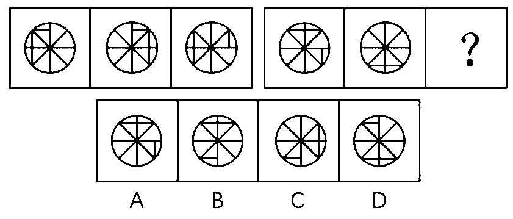

<link rel="stylesheet" href="https://zhmhbest.gitee.io/hellomathematics/style/index.css">

# [推理判断](./index.html)

[TOC]

## 图形推理

### 数量

- 线条数：直线数、曲线数、射线数等数量。
- 笔画数：需要几笔才能完成，笔画之间不能重叠。
- 封闭区域：图形、汉字、数字等的封闭区域。
- 孤立区域：不连接的区域。
- 交点个数：十字交点、一般交点（曲线交点）等。
- 对称轴个数
- 角的个数：直角、锐角个数等。
- 特殊图形个数：正方形、五角星、阴影图形的个数。
- 图形种类数

**例1**：

答案：B；线条数，“3 7 4”、“3 8 5”

**例3**：

答案：D；封闭区域递增

**例4**：

答案：C；每行交点数量相同

**例5**：与其它不一样的图形

答案：第4个；“其它均为3个三角形 + 1个四边形”

**例6**：

答案：C；

**例7**：

答案：B；阴影数“0 1 2”、“1 2 3”、“2 3 4”

**例8**：

答案：D；图例均为一笔图形

**例9**：

答案：A；合集为“曲 半曲 直”，线条为“3 5 4”

**例10**：

答案：C；第2行有一个2组合球，第3行有一个3组合球；组合球算一个单位，数量为“7 8 9”、“6 7 8”、“5 6 7”

**例11**：

答案：A；独立部分递增”

### 移动

- 旋转
- 平移
- 对称

**例1**：

答案：A；“2 = 1顺时针旋转90°后水平翻转”、“3 = 2顺时针旋转90°”

**例2**：

答案：A；“三角每次顺时针选择一边”、“直角每次逆时针旋转90°”

**例3**：

答案：D；每次逆时针旋转45°

**例4**：

答案：B；

**例5**：

答案：B；短线每次顺时针移动1格、长线每次顺时针移动4格

**例6**：

答案：B；黑弧每次顺时针移动一格，黑球每次中心对称一次

**例7**：

答案：A；其余均为顺时针

**例8**：

答案：C；“每次向上平移一格”

**例9**：

答案：D；“3 = 1垂直翻转 + 2”

**例10**：

答案：D；“2黑点每次顺时针移动一格”、“4黑点交替以中间两个黑点为中心，每次顺时针旋转90°”

### 覆盖

**例1**：

答案：C；边少的覆盖边多的

**例2**：

答案：D；“面 点 面 点 面 点”

### 消去

**例1**：

答案：A；“3 = 1 + 2 - 12重叠部分”

**例2**：

答案：D；“3 = 1 + 2 - 12重叠部分”

**例3**：

答案：A；

### 替换

**例1**：

答案：B；“1△=2□”，“3□ 5□ 7□ 9□ 11□”

**例2**：

答案：A；“1上=4下”，“10下 9下 8下 7下 6下”

### 重组

**例1**：

答案：C；2个黑点白色三角形排除AB，1个网格三角形排除D

### 剪纸

**例1**：

答案：D

### 空间

**例1**：

答案：C

### 其它

**例1**：分类

- A：①④⑥、②③⑤
- B：①②⑤、③④⑥
- C：①⑤⑥、②③④
- D：①③⑤、②④⑥

答案：B；是否有公共边

**例3**：排序

答案：C；前两行都在最左边，第三行R位置分布均匀
